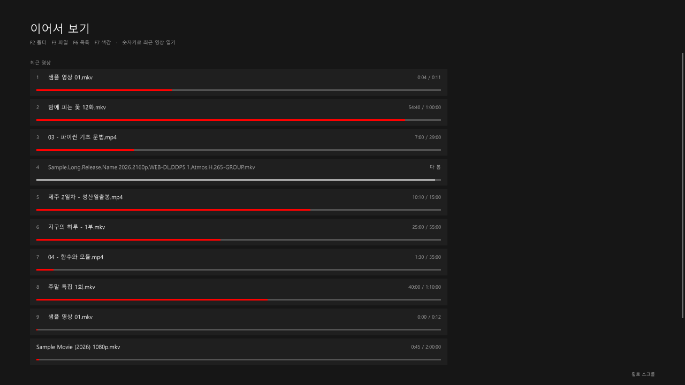
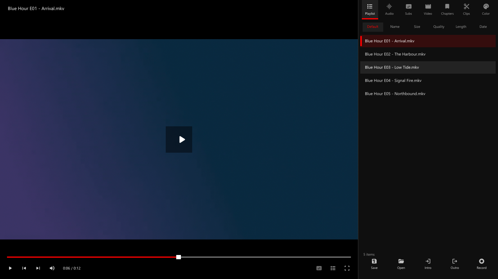
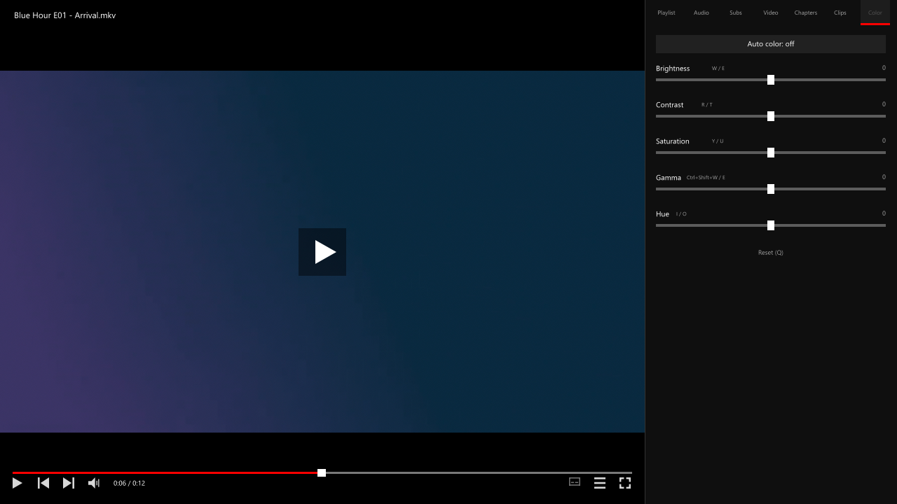

# boda

**팟플레이어처럼 쓰는 mpv 설정** — Windows용. 단축키, 창 안에 뜨는 목록 패널, 대기 화면 이어보기.

mpv는 빠르고 화질이 좋지만, 팟플레이어에서 넘어오면 단축키가 전부 낯설고 재생목록 창도 없습니다.
boda는 팟플레이어 단축키를 그대로 옮기고, 자주 쓰는 UI만 mpv 창 안에 직접 그립니다.



## 무엇이 들어 있나

- **팟플레이어 단축키** — 속도(Z/X/C), A-B 반복(`[` `]`), 북마크(P), 프레임 이동(D/F), 색감(W~O) 등
- **창 안 사이드 패널** (F6) — 재생목록 · 오디오 · 자막 · 비디오 · 챕터 · 색감을 탭으로. 영상을 가리지 않고 옆으로 밀어냅니다.
  왼쪽 가장자리를 끌어 너비를 자유롭게 조절하고(그냥 누르면 정해진 너비로 순환), 휠이나 스크롤바로 목록을 넘깁니다.
  목록은 한 번 클릭하면 바로 재생합니다
- **대기 화면 이어보기** — 재생이 끝나거나 F4로 멈추면 최근 본 영상이 진행률과 함께 뜹니다. 숫자키로 바로 열기
- **아래쪽 탐색바** — 클릭 탐색, 챕터 표시, A-B 구간 표시, 볼륨, 마우스 올리면 미리보기(ffmpeg 필요)
- **오프닝/엔딩 스킵** (Ctrl+I / Ctrl+O) — 파일마다 지점을 기억했다가 다음부터 자동으로 넘깁니다
- **이어보기 기록** — 파일별 마지막 위치를 저장. 다 본 영상은 "다 봄"으로 표시
- **PiP**(F10), **보스키**(B), **화면 캡처 클립보드 복사**(Ctrl+C), **녹화**(Ctrl+Shift+R)





## 설치

필요한 것: **mpv 0.40 이상** (0.41에서 개발·테스트), Windows 10/11

기존 설정이 있다면 먼저 백업하세요. `%APPDATA%\mpv` 폴더를 통째로 복사해 두면 됩니다.

```powershell
git clone https://github.com/skps2000/mpv-boda.git "$env:APPDATA\mpv"
```

폴더가 이미 있어서 clone이 안 되면:

```powershell
git clone https://github.com/skps2000/mpv-boda.git "$env:TEMP\mpv-boda"
Copy-Item "$env:TEMP\mpv-boda\*" "$env:APPDATA\mpv" -Recurse -Force -Exclude .git
```

zip으로 받으려면 [Releases](https://github.com/skps2000/mpv-boda/releases)에서 내려받아 `%APPDATA%\mpv` 안에 풀면 됩니다.
`mpv.conf`, `input.conf`, `script-opts\`, `scripts\` 가 그 폴더 바로 아래에 있으면 됩니다.

## 단축키

자주 쓰는 것만 추렸습니다. 전체 목록은 [docs/keys.md](docs/keys.md)에 있습니다.

| 키 | 동작 |
|---|---|
| `Space` | 재생 / 일시정지 |
| `←` `→` | 5초 이동 (Ctrl 30초, Shift 60초) |
| `↑` `↓` / 휠 | 음량 |
| `Z` `X` `C` | 속도 되돌리기 / 느리게 / 빠르게 |
| `D` `F` | 이전 / 다음 프레임 |
| `[` `]` `\` | A 지점 / B 지점 / 구간 반복 해제 |
| `P` | 북마크 추가 (Shift+PgUp/PgDn 으로 이동) |
| `F2` `F3` | 폴더 열기 / 파일 열기 |
| `F6` `F7` | 목록 패널 / 색감 패널 |
| `F9` `F10` | 선명 업스케일 / PiP |
| `Ctrl+I` `Ctrl+O` | 오프닝 끝 / 엔딩 시작 지점 저장 |
| `0`~`9` | 퍼센트 이동 (대기 화면에서는 최근 영상 열기) |
| `Q` | 색보정 껐다 켜기 (원본 비교) |
| `Tab` | 창 크기 순환 |
| `B` | 보스키 (일시정지 + 최소화) |

키를 바꾸고 싶으면 `input.conf`만 고치면 됩니다. 스크립트가 키를 가로채지 않습니다.

## 설정

`script-opts\boda.conf` 에서 바꿉니다. 고친 뒤 mpv를 다시 실행하면 적용됩니다.

| 항목 | 기본값 | 설명 |
|---|---|---|
| `font` | `Malgun Gothic` | UI 글꼴 |
| `scale` | `0` | UI 배율 (0이면 창 높이에 맞춰 자동) |
| `accent` | `FF0000` | 강조색 `#RRGGBB` |
| `auto_color` | `no` | 해상도에 따라 밝기·대비를 자동 조정 |
| `resume` | `yes` | 마지막 위치에서 이어보기 |
| `thumbnails` | `yes` | 탐색바 미리보기 (ffmpeg 필요) |
| `ffmpeg` | (자동) | ffmpeg 경로 |
| `wheel_volume` | `5` | 휠 한 칸 음량 |
| `history_size` | `60` | 대기 화면 기록 개수 |
| `panel_width` | `320` | 목록 패널 기본 너비(px) |
| `state_dir` | (자동) | 기록 저장 폴더 |

## 기록은 어디에 저장되나

시청 기록·북마크·패널 설정은 **설정 폴더가 아니라** `%LOCALAPPDATA%\mpv\boda\` 에 저장됩니다.

```
history.json     최근 본 영상과 위치
bookmarks.json   파일별 북마크
skips.json       파일별 오프닝/엔딩 지점
prefs.json       패널 너비, 정렬, 색보정 설정
```

설정 폴더를 그대로 git으로 관리해도 개인 기록이 딸려 올라가지 않도록 분리한 것입니다.
기록을 지우려면 위 폴더를 지우면 됩니다.

## 문제가 생기면

**탐색바 미리보기가 안 나와요** — `ffmpeg.exe`가 필요합니다. mpv 설치 폴더에 두거나 PATH에 넣으세요.
직접 지정하려면 `script-opts\boda.conf` 의 `ffmpeg=` 에 경로를 적으면 됩니다.

**키가 안 먹혀요** — `input.conf`에서 `Shift+글자`는 대문자로 적어야 합니다 (`Shift+n` ❌ → `N` ⭕).
어떤 키가 무엇에 연결됐는지는 mpv에서 `?`(도움말) 또는 `Ctrl+F1`(통계)로 확인할 수 있습니다.

**화면 색이 원본과 달라요** — `Q`를 누르면 색보정을 끄고 원본과 비교할 수 있습니다.
자동 보정은 기본으로 꺼져 있습니다.

**mpv가 켜질 때 오류가 보여요** — `mpv.conf`에서 값에 `#`이나 `%`가 들어가면 반드시 따옴표로 감싸야 합니다.
감싸지 않으면 그 줄이 조용히 무시됩니다.

## 테스트

패널은 마우스로 쓰는 UI라 눈으로만 확인하기 어렵습니다. 그래서 실제 클릭·드래그·휠을 흉내내는
테스트를 같이 둡니다. 돌리는 법은 [tests/README.md](tests/README.md)에 있습니다.

## 구조

```
mpv.conf                화질 · 창 · OSD · 재생 설정
input.conf              단축키 (실제로 여기가 전부다)
script-opts/boda.conf   boda 설정
scripts/boda/
  main.lua              마우스 입력 창구
  lib/  options util state ui icons
  mod/  seekbar panel idle commands dialogs history skip
```

그리기와 마우스 입력은 `lib/ui.lua` 한 곳에서만 처리합니다.
여러 스크립트가 같은 버튼을 각자 붙잡으면 나중에 켜진 쪽이 클릭을 다 먹기 때문입니다.

## 라이선스

[MIT](LICENSE)

mpv와 팟플레이어는 각각의 프로젝트/회사 것이며, 이 저장소와는 관계가 없습니다.
"팟플레이어 스타일"은 단축키 배치를 따라했다는 뜻입니다.

---

## English

**boda** is a PotPlayer-style configuration for [mpv](https://mpv.io) on Windows.
It maps PotPlayer's keyboard shortcuts onto mpv and draws the pieces of UI you actually use —
a tabbed side panel (playlist, tracks, chapters, color), a bottom seek bar with thumbnail previews,
and a "continue watching" screen when nothing is playing.

The UI text is Korean. Install by cloning into `%APPDATA%\mpv` (back up your existing config first),
then edit `input.conf` for keys and `script-opts/boda.conf` for looks and behavior.
Watch history is kept out of the config folder, in `%LOCALAPPDATA%\mpv\boda\`, so the config
directory stays safe to publish. Requires mpv 0.40 or newer.
