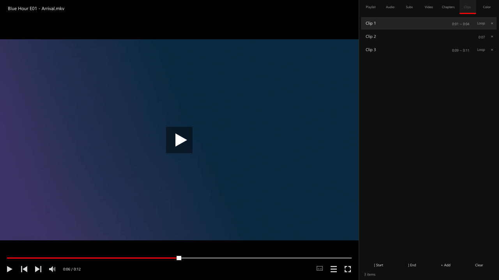
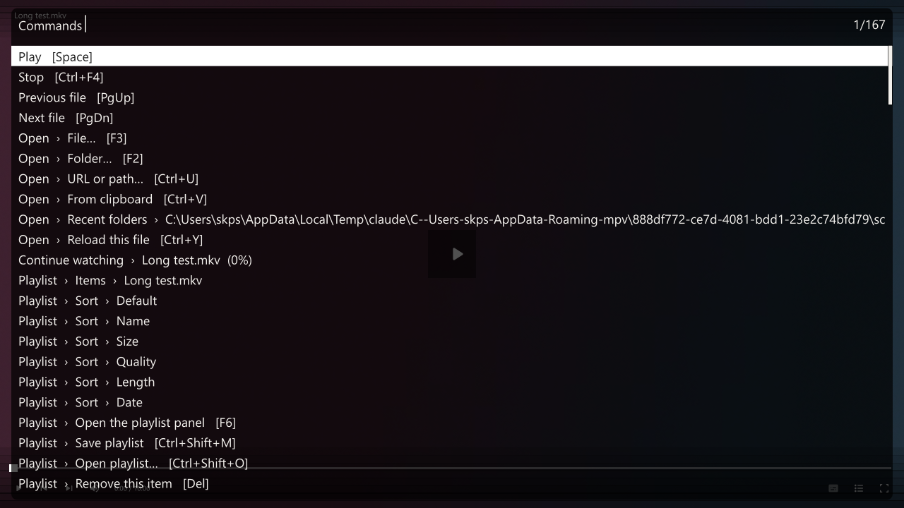

# boda

**mpv, with PotPlayer's keys and the bits of UI you actually use.** Windows.

한국어 안내는 [README.ko.md](README.ko.md)를 보세요.

mpv is fast and looks great, but coming from PotPlayer every key is unfamiliar and there is no
playlist window. boda maps PotPlayer's shortcuts onto mpv and draws the few pieces of UI that
matter, inside the mpv window.


## What you get

- **Open a folder** (F2) — recent folders come first, and the one you pick is walked
  **all the way down**, so every video in every subfolder lands in the playlist. Only videos:
  music, images and stray files are left out
- **PotPlayer keys** — speed (Z/X/C), A-B loop (`[` `]`), bookmarks (P), frame step (D/F),
  colour (W–O), and the rest
- **Side panel** (F6) — playlist · audio · subtitles · video · chapters · clips · colour as tabs.
  It pushes the video aside instead of covering it. Drag the left edge to resize freely
  (a plain click cycles preset widths), scroll with the wheel or the scrollbar, and one click
  plays a row
- **Names you recognise** — a row is named after the file, not after whatever title is buried
  inside it, so the list never renames itself as you watch. Open a playlist file and the names
  it gives its entries are kept
- **Continue watching** — when playback ends or you stop (Ctrl+F4), the folders you were working
  through come back first, then the files with their progress. Number keys open them, and either
  list can be cleared from the screen itself
- **Menu** (right click or F4) — playback, open, playlist, clips, video, audio, subtitles, colour,
  window, capture, copy. Current state shows as check marks, and right-clicking a playlist row
  gives you that row's menu
- **Command palette** (Ctrl+Shift+P) — everything the menu can do in one list. Type a few letters
  and it narrows: `deb` finds Deblock. Install [uosc](https://github.com/tomasklaen/uosc) and both
  the menu and the palette move into the player's own window instead
- **Clips** (`+`) — save this moment, click it later to play from there. Set `[` and `]` first and
  the whole range is saved, with a Loop button
- **Skip intro and outro** (Ctrl+I / Ctrl+O) — remembered per file and skipped next time
- **Resume** — every file's last position, with finished ones marked as watched
- **Seek bar** — click to seek, chapter ticks, A-B markers, volume, and hover previews (needs ffmpeg)
- **PiP** (F10), **boss key** (B), **copy frame to clipboard** (Ctrl+C), **recording** (Ctrl+Shift+R)







## Install

You need **mpv 0.40 or newer** (developed and tested on 0.41) and Windows 10/11.

Back up your current config first — copying the whole `%APPDATA%\mpv` folder is enough.

```powershell
git clone https://github.com/skps2000/mpv-boda.git "$env:APPDATA\mpv"
```

If the folder already exists:

```powershell
git clone https://github.com/skps2000/mpv-boda.git "$env:TEMP\mpv-boda"
Copy-Item "$env:TEMP\mpv-boda\*" "$env:APPDATA\mpv" -Recurse -Force -Exclude .git
```

Or download a zip from [Releases](https://github.com/skps2000/mpv-boda/releases) and unpack it into
`%APPDATA%\mpv`, so that `mpv.conf`, `input.conf`, `script-opts\` and `scripts\` sit directly in
that folder.

## Keys

The ones you reach for. The full list is in [docs/keys.md](docs/keys.md).

| Key | Action |
|---|---|
| `Space` | Play / pause |
| `←` `→` | 8 s (Ctrl 30 s, Shift 1:40) — all four steps are settings |
| `↑` `↓` / wheel | Volume |
| `Z` `X` `C` | Speed: back to normal / slower / faster |
| `D` `F` | Previous / next frame |
| `[` `]` `\` | A point / B point / clear the loop |
| `+` | Save this moment as a clip |
| `P` | Bookmark (Shift+PgUp / PgDn to jump) |
| `F2` `F3` | Open folder / file |
| `F4` | Menu (same as right click) |
| `Ctrl+Shift+P` | Command palette |
| `F6` `F7` | Playlist panel / colour panel |
| `F9` `F10` | Sharp upscale / PiP |
| `Ctrl+I` `Ctrl+O` | Mark end of intro / start of outro |
| `0`–`9` | Seek by percent (open a recent file on the idle screen) |
| `Q` | Toggle colour correction, to compare with the original |
| `Tab` | Cycle window size |
| `B` | Boss key (pause and minimise) |

Every key lives in `input.conf`, and the script never grabs one on its own, so that file is the
only place to edit.

## Settings

`script-opts\boda.conf`. Restart mpv after changing it.

| Option | Default | What it does |
|---|---|---|
| `language` | `en` | UI language: `en` or `ko` |
| `font` | `Segoe UI` | UI font |
| `scale` | `0` | UI scale (0 follows the window height) |
| `accent` | `FF0000` | Accent colour, `#RRGGBB` |
| `auto_color` | `no` | Nudge brightness/contrast per file |
| `resume` | `yes` | Continue where you left off |
| `thumbnails` | `yes` | Seek bar previews (needs ffmpeg) |
| `ffmpeg` | (auto) | Path to ffmpeg |
| `wheel_volume` | `5` | Volume per wheel notch |
| `seek_arrow` | `8` | How far `←` `→` seek, in seconds |
| `seek_ctrl` | `30` | How far `Ctrl+←` `Ctrl+→` seek |
| `seek_shift` | `100` | How far `Shift+←` `Shift+→` seek |
| `seek_alt` | `300` | How far `Ctrl+Alt+←` `Ctrl+Alt+→` seek |
| `history_size` | `60` | Files kept on the continue-watching screen |
| `panel_width` | `360` | Default panel width, px |
| `menu_sections` | (default) | Which groups the menu shows, and in what order |
| `uosc` | `yes` | Let uosc draw the menus when it is installed |
| `state_dir` | (auto) | Where history is stored |

## Where your history goes

Watch history, bookmarks, clips and panel settings live in `%LOCALAPPDATA%\mpv\boda\`, **not** in
the config folder:

```
history.json     what you watched and where you stopped
bookmarks.json   bookmarks per file
favorites.json   saved clips per file
skips.json       intro and outro points per file
prefs.json       panel width, sorting, colour settings
```

That split is what makes the config folder safe to keep in git. Delete that folder to clear
everything.

## If something is off

**No previews on the seek bar** — ffmpeg is missing. Install it and restart mpv:

```powershell
scoop install ffmpeg
winget install Gyan.FFmpeg
```

It does not have to be on PATH: you can drop `ffmpeg.exe` next to mpv, or point
`script-opts\boda.conf` at it with `ffmpeg=`.

**A key does nothing** — in `input.conf` a shifted letter is written as the capital (`N`, not
`Shift+n`). Press `?` in mpv, or `Ctrl+F1` for statistics, to see what a key is bound to.

**Colours look off** — press `Q` to switch the correction off and compare with the original.
Automatic correction is off by default.

**mpv prints an error at startup** — in `mpv.conf`, quote any value containing `#` or `%`.
Without quotes mpv drops the line silently.

## Tests

The panel and the menu are mouse-driven, so they come with tests that replay real clicks, drags
and wheel events. See [tests/README.md](tests/README.md).

## Layout

```
mpv.conf                picture · window · OSD · playback
input.conf              keys (this is the real key map)
script-opts/boda.conf   boda settings
scripts/boda/
  main.lua              the one place mouse input arrives
  lib/  options i18n util state ui icons
  mod/  seekbar panel idle menu commands dialogs history skip
```

Drawing and mouse input are handled in `lib/ui.lua` alone: when several scripts each grab the same
button, whichever armed last swallows the clicks.

## Licence

[MIT](LICENSE)

Icons are Google's [Material Symbols](https://fonts.google.com/icons), Apache-2.0, converted from
SVG to drawing commands by `tools/icons.py`; the licence is in `tools/mdi/LICENSE`.

mpv and PotPlayer belong to their own projects and companies; this repository is not affiliated
with either. "PotPlayer-style" only means the key layout was copied.
